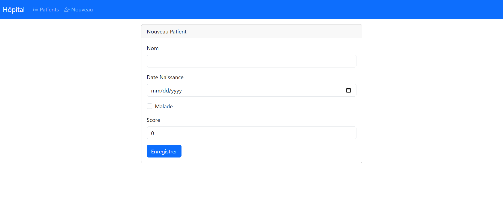
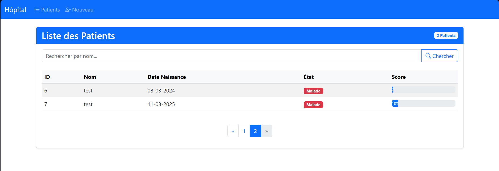

# Application de Gestion des Patients

Une application Spring Boot pour la gestion des patients d'un hôpital.

## Technologies Utilisées

- Spring Boot 3.4.3
- Spring Data JPA
- Thymeleaf
- H2 Database
- Bootstrap 5
- Lombok
- Validation

## Fonctionnalités

- Liste paginée des patients
- Recherche des patients par nom
- Ajout de nouveaux patients
- Validation des données
- Interface responsive

## Captures d'écran

### Formulaire d'ajout


### Page d'accueil - Liste des patients


## Structure du Projet

```
tp3-spring/
├── src/
│   ├── main/
│   │   ├── java/
│   │   │   └── org/example/tp3spring/
│   │   │       ├── entities/
│   │   │       ├── repositories/
│   │   │       └── web/
│   │   └── resources/
│   │       └── templates/
└── pom.xml
```

## Configuration

La base de données H2 est configurée en mémoire avec les paramètres suivants :
- URL : jdbc:h2:mem:hospital-db
- Username : sa
- Password : (vide)
- Console H2 : http://localhost:8080/h2-console

## Installation et Démarrage

1. Cloner le projet
```bash
git clone git@github.com:youssef-faik/SpringBoot-PatientManagementSystem-TP3.git
```

2. Naviguer vers le dossier du projet
```bash
cd SpringBoot-PatientManagementSystem-TP3/
```

3. Lancer l'application
```bash
./mvnw spring-boot:run
```

L'application sera accessible à l'adresse : http://localhost:8080

## Modèle de Données

### Patient
- id : Long (Clé primaire)
- nom : String (4-40 caractères)
- dateNaissance : Date
- malade : boolean
- score : int (0-100)
